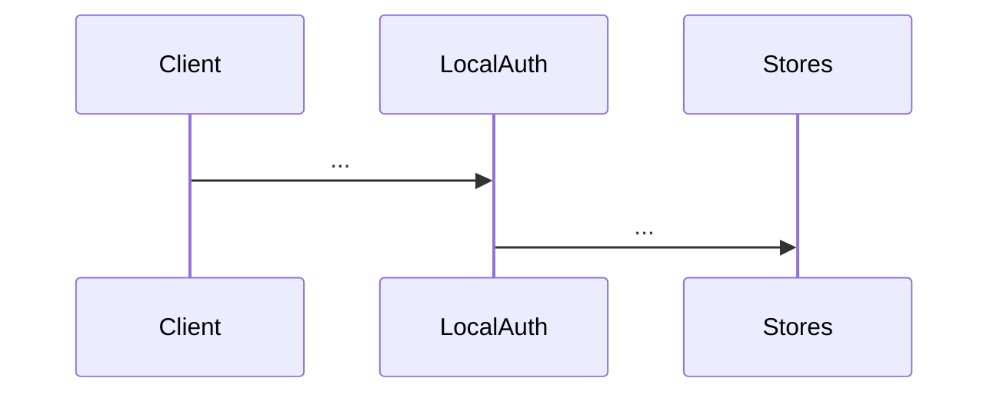

# /design rebuild

Rebuild per-folder `DESIGN.md`: a rich-markdown architecture document with inline
Mermaid sequence diagrams, an entity catalog, gotchas, and cross-folder dependency
links. One file per folder, paired with a machine-readable `.design.yaml` sidecar.

Shared conventions live in `SKILL.md`, and this mode depends on them. Read it first
for **which folders qualify**, the **`.design.yaml` schema**, the **quoting rule** for
generated prose, and the **validation** helper. This file covers only the rebuild
algorithm and the `DESIGN.md` format.

See `~/newstack/brain/DESIGN_SKILL_SPEC.md` for the system-level spec.

## When to use

- After a refactor touched one or more folders.
- When `/design check` reports a folder as stale.
- Periodically (nightly via `/schedule`, weekly manually) as the baseline freshness defense.
- Before opening a multi-folder PR so the reviewer guide can reference accurate entity names.

## Modes

- **Full rebuild** (no args, run at repo root): walk every qualifying folder. **Skip-if-fresh by default**, so a folder is left untouched when its `last_rebuilt` SHA is still in HEAD's history and nothing under it has changed since.
- **Targeted** (`--folder <path>`): one folder, with skip-if-fresh still applying. It does not re-walk the depends_on chain, so if a neighbor is also stale, run `/design check` and rebuild that one separately.
- **`--force`**: regenerate every candidate folder regardless of freshness. Use when prose came out shallow on a prior run, or you want a clean LLM pass.

After a successful run, the user should run `/design map` to refresh top-level `MAP.md`.

## DESIGN.md format

```markdown
# <folder name>

<one-paragraph overview: what the package owns, what it doesn't, what's notable about its shape>

## Contents

- [Entities](#entities)
- [Flows](#flows)
  - [<Flow 1 name>](#<kebab-case anchor>)
  - [<Flow 2 name>](#<kebab-case anchor>)
- [Gotchas](#gotchas)
- [Depends on](#depends-on)

## Entities

| Entity | Kind | Role | Why |
|---|---|---|---|
| `EntityName` | struct | <one line: what it is> | <one line: design rationale or non-obvious gotcha> |
| `EntityName.Method` | method | <one line> | <one line> |
| `InterfaceName` | interface | <one line> | <one line> |

## Flows

### <Flow Name 1>



### <Flow Name 2>

```mermaid
sequenceDiagram
    ...
```

## Gotchas

- **<short title>**. <one paragraph stating the subtle constraint, brittle coupling, or footgun>
- **<short title>**. <one paragraph>

## Depends on

- [`core/`](../core/DESIGN.md) for `User`, `Identity`, `Channel`, `ChannelStore`, ...
- [`utils/`](../utils/DESIGN.md) for `ComputeKid`, `JWK`, ...
```

Format rules:

- **One H1** for the folder name at the very top.
- **One opening paragraph** before `## Contents`.
- **`## Contents` TOC**: auto-generated from the sections actually present. Kebab-case anchors match GitHub's heading-to-anchor convention (lowercase, spaces → hyphens, punctuation stripped). Nest one level deep for flows so each flow is a TOC entry.
- **`## Entities`**: markdown table. Methods qualified as `Receiver.Method`. Backticks around identifier names in the Entity column.
- **`## Flows`**: each flow gets a `###` heading + a Mermaid `sequenceDiagram` (or `flowchart` for decision trees, not sequences). Omit the section entirely if no flows worth diagramming. Skip trivial 1–2-step flows.
- **`## Gotchas`**: bulleted list. Each gotcha is one bullet with a bolded short title plus a one-paragraph explanation. Omit the section when there are none, and don't pad.
- **`## Depends on`**: bulleted list of folders this folder depends on internally (filled by Pass 2, with Pass 1 leaving the section empty or omitting it). External deps can go in a separate sub-bullet group, though that is not required.

## Algorithm

### Pass 0 (orchestrator prep)

```bash
head_sha=$(git rev-parse HEAD)
```

Every `.design.yaml` written in this rebuild carries the same `last_rebuilt: <head_sha>` so drift detection has a consistent anchor across the whole pass.

Snapshot the **pre-rebuild** `depends_on` graph by reading the current `depends_on:` from each existing `.design.yaml`. Pass 2 uses this to decide which folders need their linking redone.

### Pass 0.5 (drift triage, skip-if-fresh)

Before dispatching any Pass 1 subagents, decide per folder whether it actually needs rebuilding. Same logic as `/design check`:

```bash
for folder in candidate_folders; do
  sidecar="$folder/.design.yaml"

  if [ ! -f "$sidecar" ]; then mark_rebuild "$folder"; continue; fi
  if [ "$FORCE" = "1" ]; then mark_rebuild "$folder"; continue; fi

  if command -v yq >/dev/null; then
    last=$(yq '.last_rebuilt' "$sidecar" 2>/dev/null)
  else
    last=$(grep '^last_rebuilt:' "$sidecar" | head -1 | awk '{print $2}')
  fi
  if [ -z "$last" ] || [ "$last" = "null" ]; then mark_rebuild "$folder"; continue; fi
  if ! git merge-base --is-ancestor "$last" HEAD; then mark_rebuild "$folder"; continue; fi
  if [ -n "$(git diff --name-only "$last" HEAD -- "$folder/")" ]; then mark_rebuild "$folder"; continue; fi

  mark_fresh "$folder"
done
```

Output: `rebuild_set` (proceed to Pass 1) and `fresh_set` (left untouched).

**First-run protection** (runs at the end of Pass 0.5, only over `rebuild_set`):

If a folder has an existing `DESIGN.md` but no `.design.yaml`, it was probably hand-written (legacy adoption case). Prompt the user before overwriting:

```bash
for folder in rebuild_set; do
  sidecar="$folder/.design.yaml"
  existing_design="$folder/DESIGN.md"

  if [ -f "$existing_design" ] && [ ! -f "$sidecar" ]; then
    echo "FIRST RUN: $folder/DESIGN.md exists but $folder/.design.yaml does not."
    echo "  Overwriting will replace the file's contents entirely."
    read -p "  Overwrite $folder/DESIGN.md? (yes / skip) " answer
    [ "$answer" = "skip" ] && remove_from_rebuild_set "$folder" && add_to_skip_set "$folder"
  fi
done
```

After the first successful rebuild, `.design.yaml` is present and signals "this folder is skill-managed", so subsequent runs skip the prompt and overwrite freely.

### Pass 1 (per-folder generation, parallel subagents)

For each candidate folder in `rebuild_set`, spawn one `Agent` with `subagent_type=general-purpose` and the following prompt:

> Read every source file in `<folder>` (don't follow imports to sibling folders or descend into examples/test fixtures, but DO include `*_test.go` if useful for understanding the public contract). Identify:
>
> - **Folder name / package identity** (from the language's convention, so `package <name>` in Go, `pub mod` in Rust, module path in Python/TS).
> - **Purpose**, in one sentence covering what the folder owns, what it deliberately doesn't, and what's notable about its shape.
> - **Entities** worth naming, meaning exported structs/classes/interfaces plus key functions and methods. For each: name, kind, role (one line), why (one line of design rationale, the non-obvious why, not what the code does).
> - **Flows**, meaning multi-step interactions worth diagramming (signup, request lifecycle, handshake, state machine, retry/rollback, etc.). For each: participants and message order. Skip trivial 1-2-step flows.
> - **Gotchas**, meaning non-obvious asymmetries, brittle couplings, and footguns. Skip if there are none.
>
> Write two files into `<folder>` (do not commit, do not touch files outside `<folder>`):
>
> ---
>
> **(1) `.design.yaml`** carries machine-readable metadata and is always written. Schema:
>
> ```yaml
> package: <name>
> purpose: "<one-sentence purpose>"
> language: <go|ts|rust|python|...>
> last_rebuilt: <head_sha>
> last_rebuilt_at: <ISO 8601 UTC>
> entities:
>   - name: <name>
>     kind: <kind>
>     role: "<one line>"
>     why: "<one line>"
> depends_on: []                    # leave EMPTY; Pass 2 fills it
> ```
>
> **Quote `purpose`, `role` and `why` with double quotes, always.** They carry
> prose about code, and prose about code breaks unquoted YAML: a value cannot
> start with a backtick or a quote character, and cannot contain `: `. All three
> come up constantly (``role: `ListApps` returns…``, `role: … returns {Active:
> false}`, `why: '~'-prefixed parts…`). Inside the quotes, escape `\` as `\\` and
> `"` as `\"`, and prefer backticks over double quotes when naming an identifier so the
> escaping stays rare. Leave `name`, `kind`, `package`, `language` and
> `last_rebuilt` unquoted, they are identifiers and SHAs.
>
> **Then verify it parses**, before you report the folder done:
>
> ```bash
> ruby -ryaml -e "YAML.load_file('<folder>/.design.yaml')" \
>   || python3 -c "import yaml,sys; yaml.safe_load(open('<folder>/.design.yaml'))"
> ```
>
> A parse error is a bug in the file you just wrote. Fix the quoting and re-check.
> A sidecar that does not parse is invisible to every consumer, so it reads as an
> undocumented folder rather than as an error.
>
> ---
>
> **(2) `DESIGN.md`** is the rich-markdown architecture document, fully skill-owned. EXACT structure:
>
> ```markdown
> # <folder name>
>
> <one-paragraph overview>
>
> ## Contents
>
> - [Entities](#entities)
> - [Flows](#flows)           # omit if no flows
>   - [<Flow 1>](#<anchor 1>)
>   - [<Flow 2>](#<anchor 2>)
> - [Gotchas](#gotchas)        # omit if no gotchas
> - [Depends on](#depends-on)  # always include (Pass 2 fills the section)
>
> ## Entities
>
> | Entity | Kind | Role | Why |
> |---|---|---|---|
> | `EntityName` | struct | ... | ... |
> | `EntityName.Method` | method | ... | ... |
>
> ## Flows
>
> ### <Flow Name 1>
>
> ` ``mermaid
> sequenceDiagram
>     participant C as Client
>     participant L as LocalAuth
>     C->>L: ...
> ` ``
>
> ### <Flow Name 2>
>
> ` ``mermaid
> sequenceDiagram
>     ...
> ` ``
>
> ## Gotchas
>
> - **<short title>**. <one paragraph>
> - **<short title>**. <one paragraph>
>
> ## Depends on
>
> *(filled by Pass 2, leave empty here)*
> ```
>
> Format rules:
>
> - **TOC anchors** are GitHub-standard kebab-case: lowercase the heading, replace spaces with `-`, strip punctuation. `## Entities` → `#entities`. `### Signup flow` → `#signup-flow`.
> - **Entity table**: a markdown table, with backticks around identifier names and methods qualified as `Receiver.Method`.
> - **Mermaid**: use `sequenceDiagram` for temporal sequences. Use `flowchart` only for decision trees, not sequences. Each flow gets its own `###` heading.
> - **Omit sections that are empty** (`## Flows` if there are no flows, `## Gotchas` if there are no gotchas). Always include `## Entities` and `## Depends on` (the latter populated by Pass 2).
> - **No HTML comments** anywhere. GitHub renders most things fine, so just stay in standard markdown.
> - **Wrap prose lines reasonably** for readability (~100 cols). Tables and code blocks don't need wrapping.
>
> Do not commit. Do not read files outside `<folder>`. Do not modify any file outside `<folder>`. Do not touch `doc.go`, `README.md`, or any other language-native doc file in this folder, which are all out of skill scope.

Spawn all per-folder subagents in a single message so they run concurrently.

### Pass 2 (cross-folder linking, parallel subagents)

Pass 2 re-runs only for folders whose `depends_on:` may have shifted:

- Every folder in `rebuild_set`, AND
- Every folder whose **pre-rebuild** `depends_on:` referenced any folder in `rebuild_set`.

For each affected folder, spawn one `Agent` (`subagent_type=general-purpose`) with this prompt:

> Read `<folder>/.design.yaml` and `<folder>/DESIGN.md`. Determine the repo's module/dependency convention (read `go.mod` for Go, `package.json` for TS, `Cargo.toml` for Rust, etc.) to find the module root. Grep `<folder>`'s source files (excluding tests if separable) for imports/usages that target sibling folders in this repo. For each sibling used:
>
> 1. Read that sibling's `.design.yaml` to enumerate its declared entities.
> 2. Scan `<folder>`'s code for actual references to those entities.
>
> Update **both**:
>
> **`<folder>/.design.yaml`**, the `depends_on:` block:
>
> ```yaml
> depends_on:
>   - path: <relative path to sibling, e.g. ../core>
>     entities: [Entity1, Entity2, ...]
> ```
>
> **`<folder>/DESIGN.md`**, the `## Depends on` section:
>
> ```markdown
> ## Depends on
>
> - [`core/`](../core/DESIGN.md) for `User`, `Identity`, `Channel`, ...
> - [`utils/`](../utils/DESIGN.md) for `ComputeKid`, `JWK`, ...
> ```
>
> Touch ONLY the `depends_on:` field in `.design.yaml` and the `## Depends on` section in DESIGN.md. Do not modify any other section. Do not commit.

Parallel, with the orchestrator coordinating only.

### Pass 2.5 (sidecar parse sweep, single orchestrator pass)

Every sidecar Pass 1 or Pass 2 wrote has to parse. Each subagent checks its own
file, but this sweep is the one that runs unconditionally, so a subagent that
skipped its check does not ship a silently-invisible folder.

```bash
for sidecar in $(git ls-files '*.design.yaml'; git ls-files -o --exclude-standard '*.design.yaml'); do
  ruby -ryaml -e "YAML.load_file('$sidecar')" 2>&1 >/dev/null \
    || python3 -c "import yaml,sys; yaml.safe_load(open('$sidecar'))" 2>&1 >/dev/null \
    || echo "INVALID: $sidecar"
done
```

Repair any file that fails, almost always by quoting a `purpose`, `role` or `why`
whose prose starts with a backtick or a quote, or contains `: `. Re-check, and
carry the count into the summary.

### Pass 3 (top-level constraint verification, single orchestrator pass)

Walk repo-root `CONSTRAINTS.md` and `CAPABILITIES.md` if they exist. For each rule with an `**Entities**:` line (the additive binding):

- Parse the comma-separated qualified refs (`<folder>/Entity` form).
- For each ref, read the named folder's `.design.yaml` and verify the entity name exists in its `entities:` list.

Report unresolved refs. Do NOT auto-fix.

Rules with no `**Entities**:` line are fine, because the additive binding is opt-in.

## Output

End the skill with a structured summary and review nudges:

```
Rebuilt:    N folders (Pass 1 ran, DESIGN.md + .design.yaml written)
  - path/to/folder-a (12 entities, 2 flows)
  - path/to/folder-b (5 entities, 0 flows)
Fresh:      F folders (skip-if-fresh, left untouched)
Ineligible: M folders (pass-through, excluded, or no source worth modeling)
Cross-folder linking updated: K folders (Pass 2)
Sidecars parsed: S ok, T repaired (Pass 2.5)
Top-level refs verified: P pass, Q fail
  FAIL: CONSTRAINTS.md "<rule name>", <folder>/<Entity> not in <folder>/.design.yaml

Files per folder: DESIGN.md, .design.yaml.

If any folder was rebuilt, MAP.md may now be stale. Run /design map.

Review with `git diff` and commit (or `git restore`) per folder. This skill never commits.
```

## Principles

- One folder per subagent. Orchestrator never reads folder source. Subagents must not read across folder boundaries during Pass 1.
- All `.design.yaml` files in a single rebuild share one `last_rebuilt` SHA. Drift detection depends on the consistency.
- **Re-runs are no-ops on unchanged folders.** Skip-if-fresh is the default, and `--force` regenerates. This matters for nightly schedules, and for not stomping prose the user may have hand-tuned.
- **DESIGN.md is fully skill-owned.** Rewritten from scratch each rebuild. No markers, no preservation logic. A user who wants narrative beyond what the skill generates hand-authors it in `ARCHITECTURE.md` or `README.md`, not in DESIGN.md.
- **No mode touches language-native doc files** (`doc.go`, `README.md`, `lib.rs`, etc.). Those are human/agent territory.
- Never auto-commit. Never auto-branch.
- Never auto-add `**Entities**:` lines to existing `CONSTRAINTS.md` / `CAPABILITIES.md` rules, since humans declare bindings.
- This mode does not generate `MAP.md`. That's `/design map`'s job, and rebuild only nudges the user to run it when rebuilds happened.
- **Inline Mermaid in DESIGN.md.** No separate `diagrams.md` file. GitHub renders Mermaid natively in `.md`, so readers see flows next to the entities they involve.
